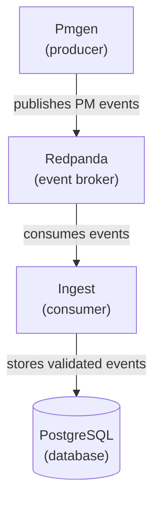
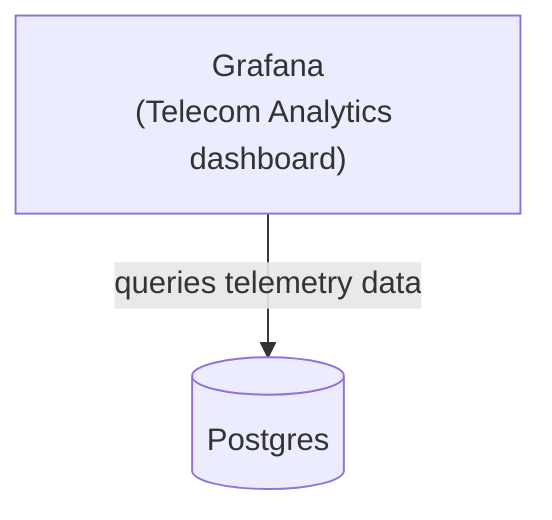
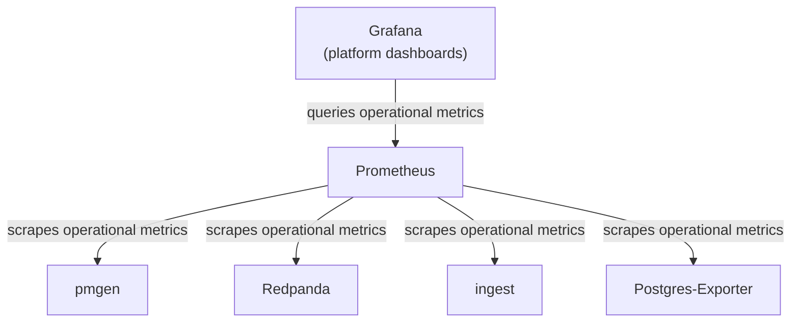

# Phase 1 Architecture

## 1. Overview

The analytics platform implements a monitoring tool for a large-scale
telecommunications platform. An event generator component generates simulated telecom telemetry
data, which is channeled via an event transmission pipeline to a metrics database. The
database provides time series data for monitoring the health of the telecommunications platform.

The diagrams that follow show the high-level components.

### 1.1. Event Flow

The generator (pmgen) sends the telemetry data as *events* to the event broker (Redpanda),
which in turn delivers the events to the collector (ingest). The collector stores the
data in an SQL database (Postgres). This event flow is shown in the following diagram. 




### 1.2. Telecom Analytics Dashboard

The Telecom Analytics dashboard provides information to monitor the (simulated)
telecommunications network. The purpose is distinct from the other
dashboards, which support monitoring the analytics platform itself.



### 1.3. Platform Dashboards

Platform dashboards provide information about the analytics platform overall
and the individual services that comprise it.




## 2. Components

### 2.1. Pmgen - Performance Management Event Generator

  - Written in Python
  - Generates telecom telemetry (simulated) as events
  - Publishes events to the Kafka pm.events topic.

**Event example (JSON)**

```json
{
  "event_id": "uuid",
  "schema_version": 1,
  "source": "pmgen",
  "event_time": "2025-12-29T20:45:12Z",
  "entity_type": "cell",
  "entity_id": "CELL-000123",
  "metrics": {
    "dl_prb_util_pct": 73.2,
    "ul_prb_util_pct": 41.8,
    "rrc_conn_avg": 18,
    "drop_rate_pct": 0.7
  }
}
```

### 2.2. Ingest -- Event Ingestion Service

  - Written in JavaScript/Node.js/Express
  - Consumes Kafka events
  - Validates events
  - Stores event data to Postgres SQL database
    - raw events inserted into `pm_events` table

### 2.3. Postgres -- Metrics Database

  - Stores telecom analytics data
    - raw events stored as jsonb
    - cooked data available as time series optimized views
  - Grafana datasource for visualization

### 2.4. Redpanda -- Kafka-Compatible Event Broker


### 2.7. Prometheus -- Metrics collector


### 2.6. Grafana -- Metrics Visualization


## 3. Data model (Postgres)

### `pm_events` (raw)

* `event_id` UUID PRIMARY KEY (enforces idempotency)
* `event_time` timestamptz NOT NULL
* `ingest_time` timestamptz NOT NULL DEFAULT now()
* `source` text NOT NULL
* `entity_id` text NOT NULL
* `metrics` jsonb NOT NULL

Recommended indexes:

* `(event_time)`
* `(entity_id, event_time)`
* GIN on `metrics` only if needed later (avoid premature indexing)

### KPI query strategy (Phase 0)

Start with a **SQL view** that buckets by time and computes aggregates. Example conceptually:

* bucket = 1 minute or 5 minutes
* KPI = average `dl_prb_util_pct` across all cells (or per selected cell)

You can keep this simple by extracting metric values from JSONB in SQL. In Phase 1, you can normalize metrics or move to OLAP.

